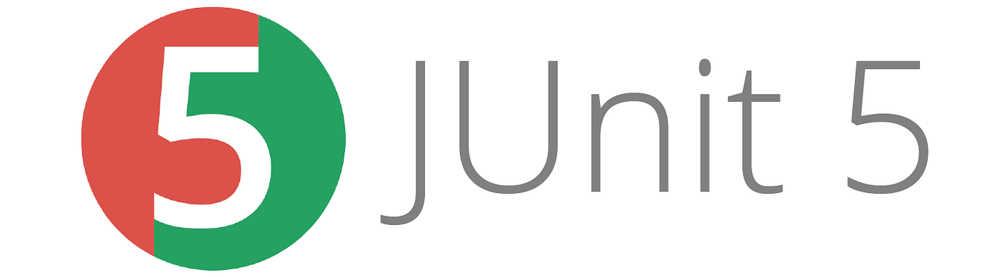

# 🙋 Quentin Beraud

## 🌱 About me 

💭 I’m currently learning "Cybersecurity Certificate"
 
👩🏻‍💻 Junior Java Developer passionate about software development and problem-solving 
 
👩🏻‍🎓 Studied Application Developer - Java at OpenClassRooms
 
 Studied  Mechanical Engineering and Production Technology at the University of Lyon 1, France 

## 🧰 Tech Stack
 

 

 

## 📊 Stats

  
  

